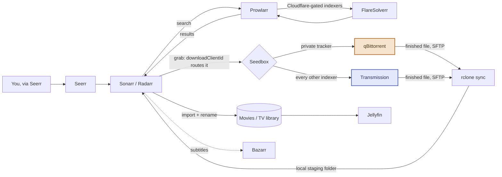
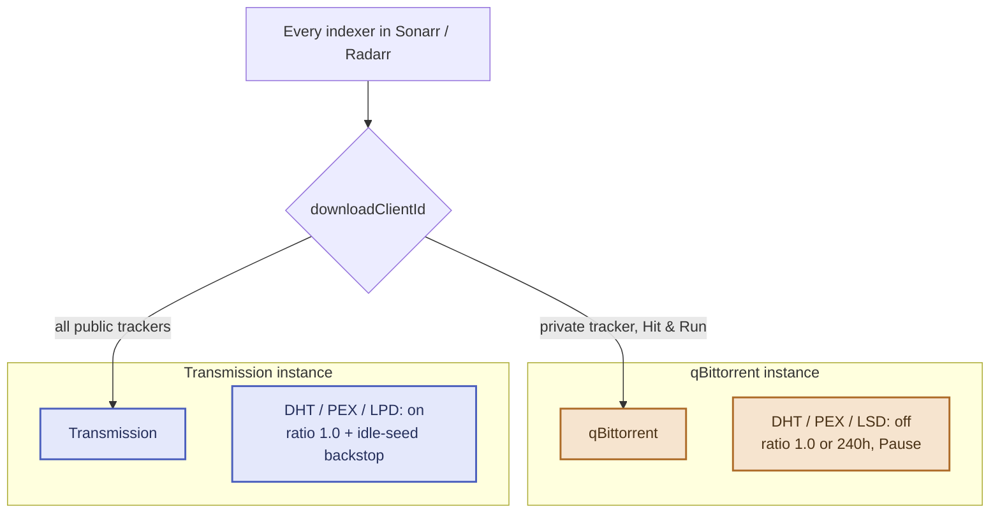
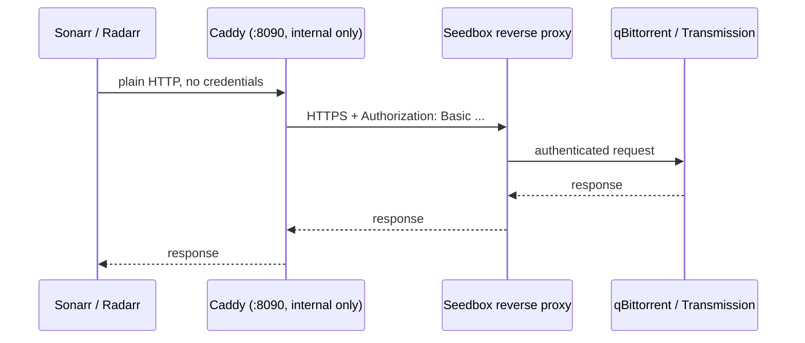
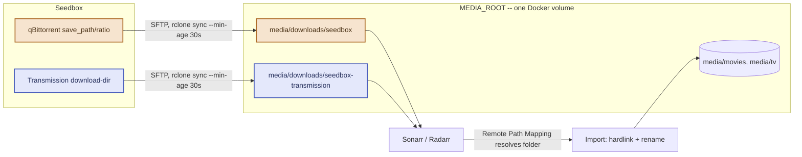
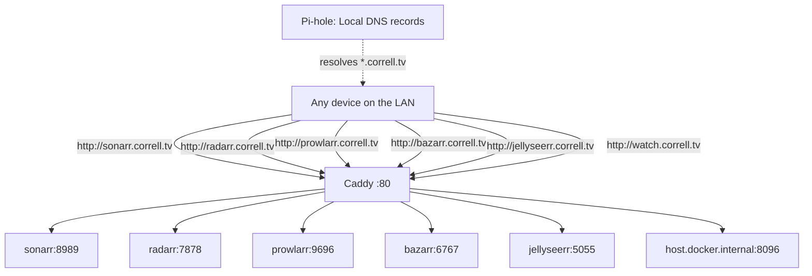
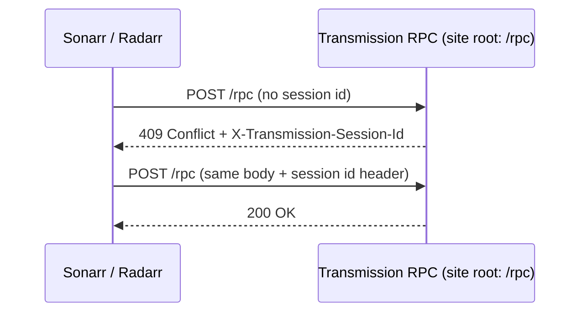
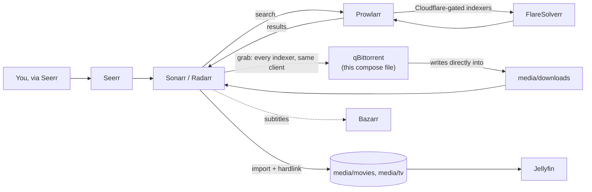

# Architecture diagrams

Six diagrams covering the request-to-playback path, the seedbox's two-client split, the
Caddy auth shim, the rclone sync/import pipeline, LAN hostname routing, and one protocol
quirk (Transmission's RPC handshake) worth having a picture of, plus a seventh for the
alternative `local` download mode. See `README.md` for the full write-up each of these
summarizes.

**Diagrams 1–6 are `seedbox` mode** (`DOWNLOAD_MODE=seedbox` in `.env`, the default).
**Diagram 7 is `local` mode** (`DOWNLOAD_MODE=local`) — a simpler, seedbox-free
alternative; see README's Local mode section. Only one mode is active in a given
deployment.

**Color key, used consistently below:** 🟧 private tracker path (qBittorrent, Hit & Run
compliance) · 🟦 public tracker path (Transmission, peer discovery on).

---

## 1. Request to playback

> Nothing downloads at home anymore — Sonarr/Radarr only decide *what* and *where*; the
> seedbox does the actual torrenting for every indexer.

---

## 2. Why there are two seedbox clients

> DHT/PEX/LSD are per-*instance* settings in qBittorrent, not per-download-client-entry —
> one client can't be "off" for one tracker and "on" for another. The private tracker's
> rules require it globally off; public releases genuinely need it on for peer discovery.
> Two real client processes resolve that; two Sonarr download-client entries pointing at
> the same qBittorrent would not have.

---

## 3. The Caddy auth shim

> Neither Sonarr/Radarr's qBittorrent nor Transmission client type has a field for Basic
> Auth separate from the client's own login — Caddy injects the header so neither app
> needs credentials for the seedbox's proxy at all. One shim, shared by both clients,
> since it proxies by host rather than by path.

---

## 4. Sync and import

> Runs on a hidden-window scheduled task, one client at a time. Each Remote Path Mapping
> has to match its matching sync target exactly — including the category subfolder the
> client appends on its own — or Sonarr/Radarr look for the file one directory level away
> from where it actually lands. The downloads and library folders being subfolders of one
> shared volume isn't cosmetic — it's what makes the import a real hardlink (one copy of
> the data, two names) instead of a silent full duplicate; split them into separate Docker
> mounts and hardlinking breaks with no error, just double disk usage.
>
> A separate scheduled script (`scripts/seedbox-cleanup.py`) closes the loop: once a
> torrent is paused/stopped at its own seed target *and* confirmed imported (checked
> against Sonarr/Radarr history, not guessed), it deletes the seedbox copy — never the
> client's own "delete on limit," which races this same sync. The local staging mirror
> isn't touched directly; it just disappears on the sync's next run once the remote
> source is gone.

---

## 5. LAN hostnames

> A real registered TLD (`.tv`) is used instead of a made-up one so browsers actually
> navigate to it instead of treating it as a search query — the Public Suffix List check
> made-up TLDs tend to fail.

---

## 6. A protocol quirk worth having a picture of

> Transmission's own web UI resolves its RPC endpoint relative to the *page's* URL, not
> the JS file's — so the real endpoint sits at `/rpc`, not `/transmission/rpc` the way the
> visible URL prefix suggests. This is why the Sonarr/Radarr client's UrlBase has to be
> set empty rather than left at its documented default.

---

## 7. Local mode: no seedbox

> No rclone, no Remote Path Mapping, no dual-client split — qBittorrent runs in this
> compose file and writes straight into the same `${MEDIA_ROOT}:/media` mount Sonarr/
> Radarr already use, so import is a direct hardlink with no remote-to-local translation
> step in between. The tradeoff for that simplicity: no VPN by default (public swarms see
> your home IP — optionally fixable by layering `compose.vpn.yml` on top, which routes
> this same qBittorrent through Gluetun instead) and no ratio/seed-time management (not
> suitable for most private trackers) — see README's Local mode section.
